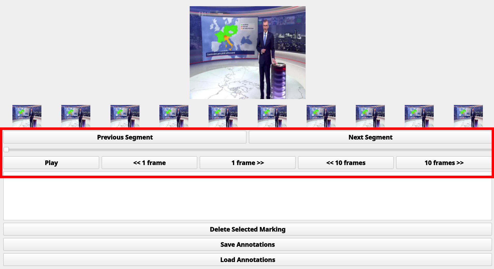
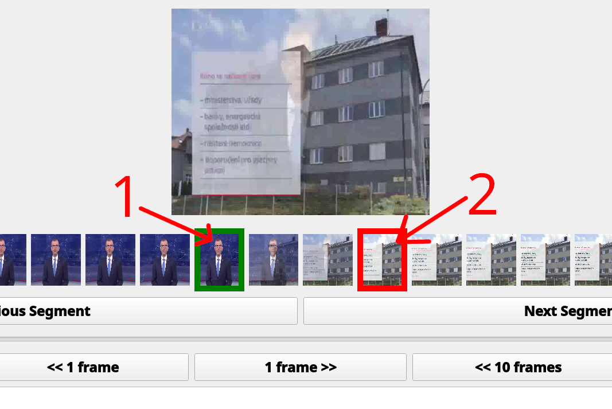
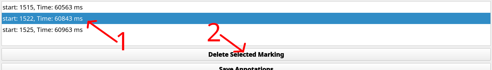

## 🖼 Anotační nástroj pro segmentaci videa (detekce střihů)

Tento nástroj slouží k **ruční anotaci střihů ve videích**. Umožňuje pohodlně označit začátek a konec střihu, procházet jednotlivé snímky a uložit anotace do souboru `.json` pro další zpracování nebo trénování modelů.

---

### ▶️ Spuštění nástroje

1. Ujistěte se, že máte nainstalováno prostředí dle pokynů v části [📥 Instalace](instalace.md) (lokální instalace).
2. Spusťte anotační nástroj s konkrétním videem:

```bash
python -m AnnotationTool video.mp4
```

---

### 🧭 Navigace ve videu

Pro pohyb mezi snímky slouží slider, tlačítka pro přeskakování snímků, klávesové zkratky a přeskakování mezi anotacemi.

| Klávesa          | Funkce                        |
|------------------|-------------------------------|
| `h`              | Posun zpět o 1 snímek         |
| `l`              | Posun vpřed o 1 snímek        |
| `Shift + h`      | Posun zpět o 10 snímků        |
| `Shift + l`      | Posun vpřed o 10 snímků       |
| `Space`          | Přehrání / pauza              |



---

### ✂️ Označení střihu

1. Pomocí slideru vyberte začátek přechodu (první snímek).
2. Klikněte znovu na konec přechodu (poslední snímek).

Oba snímky se označí jako jeden **střihový přechod**.



---

### ❌ Mazání střihů

Každý střih se zobrazí v seznamu. Pro jeho smazání:

1. Vyberte položku v seznamu střihů.
2. Klikněte na tlačítko **Delete Selected Marking**.



---

### 💾 Uložení a načtení anotací

- Anotace lze uložit a znovu načíst pomocí příslušných tlačítek v GUI.
- Každý soubor typu `.json` obsahuje anotace pro jedno konkrétní video.
- Anotace se ukládají do **kořenového adresáře projektu**.
- Pro jedno video lze vytvořit více sad anotací – každý soubor typu `.json` může mít jiné jméno.

---

### 📄 Formát výstupního souboru JSON 

```json
{
  "cuts": [
    {
      "start": 92,
      "time_start": 3677,
      "end": 96,
      "time_end": 3837
    },
    {
      "start": 373,
      "time_start": 14911,
      "end": 376,
      "time_end": 15030
    }
  ]
}
```

- `start` a `end`: indexy snímků označujících začátek a konec střihu
- `time_start` a `time_end`: časové značky v milisekundách

---

Tento nástroj je ideální pro přípravu trénovacích dat nebo validaci výsledků automatických metod segmentace.

---
