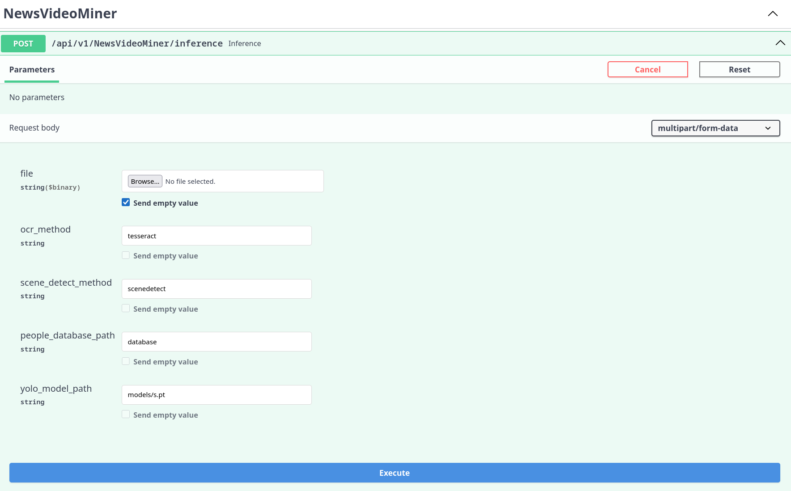

## 🛰 Rozhraní API pro zpracování videa

Systém poskytuje jednoduché rozhrání REST API, které slouží k analýze televizních pořadů. Endpoint podporuje nahrání video souboru a **volitelnou specifikaci parametrů** pro jednotlivé moduly (OCR, segmentace, detekce osob a log). Pokud parametry nejsou uvedeny, použijí se výchozí hodnoty ze souboru `config.yml`.

---

### 🌐 Rozhraní Swagger

API je vybaveno interaktivní dokumentací (Swagger UI), která je dostupná po spuštění služby na adrese:

```
http://localhost:8000/api/v1/docs
```

Zde lze snadno otestovat API ručně – nahrát video, nastavit parametry a spustit inferenci.



---

### 🔁 Endpoint

```
POST /api/v1/NewsVideoMiner/inference
```

#### Parametry (multipart/form-data):

- `file`: **(povinné)** Video soubor (např. MP4, AVI…)
- `ocr_method`: Metoda pro rozpoznávání textu
  - Možnosti: `tesseract`, `easyocr`, `paddleocr`
  - Výchozí: hodnota `tesseract`
- `scene_detect_method`: Metoda pro segmentaci scén
  - Možnosti: `ffprobe`, `scenedetect`, `transnet`, `autoshot`
  - Výchozí: hodnota `scenedetect`
- `people_database_path`: Relativní cesta k databázi osob
  - Výchozí: `PEOPLE_DB_PATH` z `config.yml`
- `yolo_model_path`: Relativní cesta k YOLO modelu
  - Výchozí: `YOLO_MODEL_PATH` z `config.yml`

---

### 📥 Příklady požadavků (cURL)

#### 1. Pouze video soubor (ostatní parametry se převezmou z výchozí konfigurace)

```bash
curl -X POST http://localhost:8000/api/v1/NewsVideoMiner/inference \
  -F "file=@test_videos/sample_news_clip.mp4"
```

#### 2. Video soubor s vlastním nastavením parametrů

```bash
curl -X POST http://localhost:8000/api/v1/NewsVideoMiner/inference \
  -F "file=@test_videos/sample_news_clip.mp4" \
  -F "ocr_method=paddleocr" \
  -F "scene_detect_method=transnet" \
  -F "people_database_path=assets/people" \
  -F "yolo_model_path=assets/yolo/yolov8n.pt"
```

---

### 🐍 Příklad volání z Pythonu

```python
import requests

url = "http://localhost:8000/api/v1/NewsVideoMiner/inference"
files = {
    "file": open("test_videos/sample_news_clip.mp4", "rb")
}

# 1. Pouze s výchozí konfigurací (žádné data parametry)
response = requests.post(url, files=files)

# 2. Nebo s vlastní konfigurací
data = {
    "ocr_method": "easyocr",
    "scene_detect_method": "scenedetect",
    "people_database_path": "assets/people",
    "yolo_model_path": "assets/yolo/yolov8n.pt"
}
response = requests.post(url, files=files, data=data)

print(response.json())
```

---

### 📤 Výstup

Výsledkem je formát typu JSON obsahující seznam segmentů (scén), kde každá obsahuje:

- `scene_info`: informace o segmentu (id, čas začátku a konce, číslo snímku)
- `ocr_text`: rozpoznaný text
- `detected_people`: seznam rozpoznaných osob (pokud byly nalezeny)
- `tv_logo`: nalezené televizní logo (název/klasifikace)

Ukázka jedné scény ve výstupu:

```json
{
  "scene_info": {
    "id": 0,
    "frame_number": 1234,
    "begin_time": "00:00:12.400",
    "end_time": "00:00:15.700"
  },
  "ocr_text": "Události České televize",
  "detected_people": ["Petr Fiala"],
  "tv_logo": "CT24"
}
```

---
