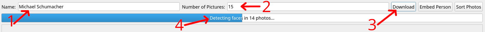
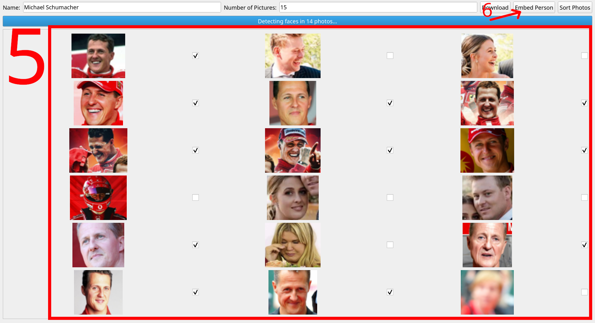

## 👤 GUI Správa databáze osob

Tento nástroj slouží k jednoduchému přidávání nových osob do databáze. Pomocí přehledného grafického rozhraní umožňuje stáhnout obličeje z internetu, ověřit jejich správnost a následně uložit embeddingy, které se využívají během inferencí.

---

### 🧰 Požadavky

1. Mějte nainstalováno prostředí podle pokynů v části [📥 Instalace](instalace.md) (lokální instalace bez Dockeru).
2. Vytvořte soubor `.env` v kořenovém adresáři s následujícím obsahem:

```
BING_SEARCH_V7_SUBSCRIPTION_KEY=vas_apiklic
BING_SEARCH_V7_ENDPOINT=https://api.bing.microsoft.com/
```

> 🌐 Pro stažení obrázků je nutné být připojen k internetu a mít aktivní přístup do Bing Search API (Azure).

---

### ▶️ Spuštění GUI

GUI se spouští příkazem:

```bash
python -m PeopleFinder
```

---

### 📸 Práce s aplikací

1. Zadejte **jméno a příjmení** osoby (např. `Michael Schumacher`)
2. Zadejte počet požadovaných obrázků (např. `30`)
3. Stiskněte tlačítko **Download**



4. Počkejte, než se obrázky stáhnou a automaticky zpracují. Detekce obličejů proběhne automaticky.



5. Zaškrtněte snímky, na kterých se skutečně nachází hledaná osoba.
6. Klikněte na **"Embed Person"**, čímž dojde k extrakci embeddingů.


---

### 💾 Struktura uložených dat

Veškerá data jsou ukládána do složky specifikované v konfiguračním souboru (`PEOPLE_DB_PATH`, výchozí hodnota je `PeopleFinder/People/database`).

Pro každou osobu se vytvoří:

- `jmeno.json`: metadata o osobě a použitých fotografiích
- `jmeno.pkl`: extrahované embeddingy obličejů
- `.jpg`: snímky, z nichž byly embeddingy získány

> Struktura složky není hierarchická – všechny soubory se ukládají do jedné úrovně.

---

Po přidání nové osoby je databáze připravena k použití při inferenci na videích.

---
